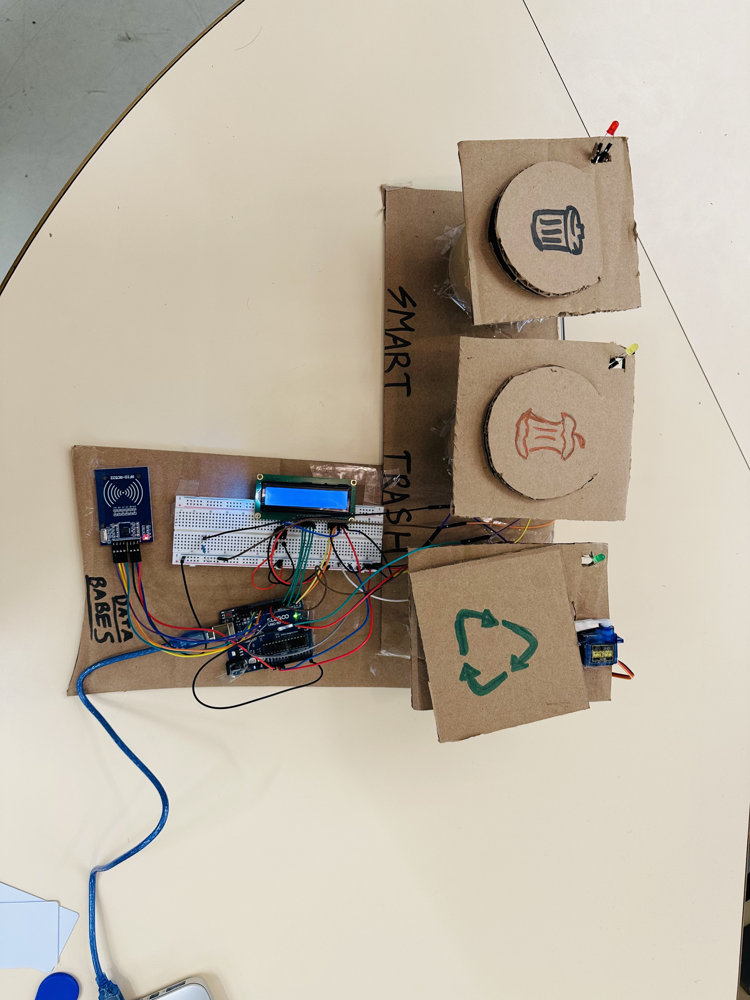
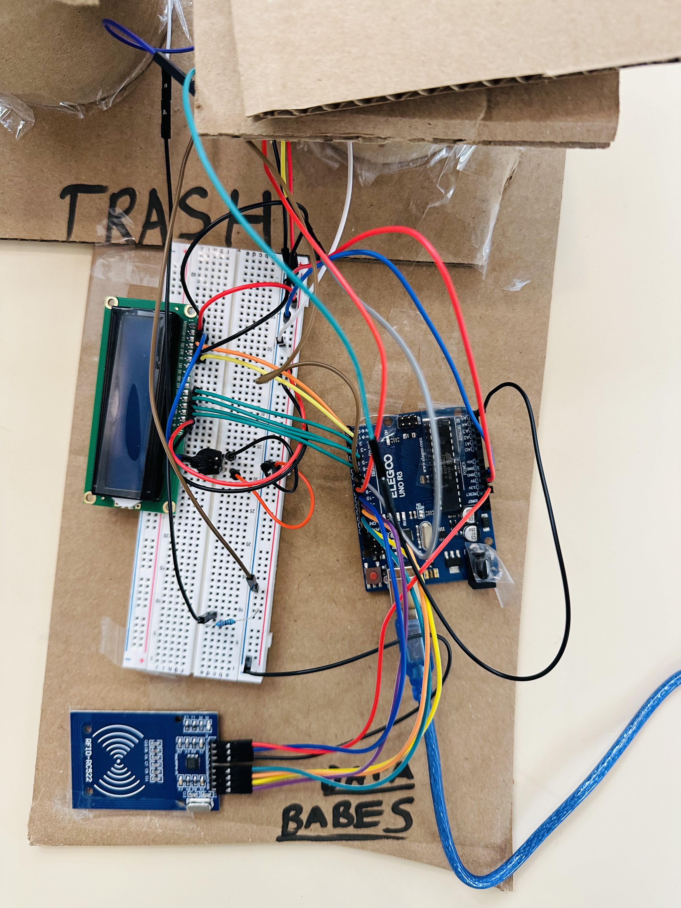

# **Détecteur de Tri des Déchets par RFID**

## **Description**
Ce projet a été réalisé dans le cadre de la première édition du hackathon **StarHack**, une compétition de robotique intensive de 8 heures visant à concevoir et présenter l'idée la plus innovante sur le thème du développement durable, avec une équipe de 6 membres. Nous avons remporté la première place 🏆 grâce à notre idée représenté par notre prototype. L'objectif du projet était de développer un dispositif capable de détecter automatiquement le type de déchet (compostable, recyclable ou jetable) à l’aide de la technologie RFID. Le dispositif affiche ensuite les informations sur un écran LCD, allume une DEL correspondante et simule une action mécanique de tri via un servomoteur.

---

## **Aperçu du dispositif**
Voici une image du prototype que nous avons conçu lors du hackathon :

---

## **Caractéristiques principales**
- **Détection RFID** : Identification des déchets via des cartes RFID associées.
- **Indicateur visuel** : Affichage du type de déchet détecté sur un écran LCD.
- **Indicateur lumineux** : LEDs colorées pour chaque catégorie de déchet.
- **Action mécanique** : Simulation du tri avec un servomoteur.
- **Catégories prises en charge** :
  - Compostable
  - Recyclable
  - Jetable

---

## **Matériel utilisé**
1. **Carte Arduino** : Contrôle des périphériques.
2. **Module RFID MFRC522** : Lecture et identification des cartes RFID.
3. **Servomoteur** : Simulation d’un mécanisme de tri.
4. **Écran LCD 16x2** : Affichage des informations.
5. **LEDs** : Indicateurs lumineux pour les différentes catégories.
6. **Composants divers** : Résistances, fils de connexion, breadboard, etc.

---

## **Utilisation**
1. Allumez le dispositif.
2. Passez une carte RFID devant le capteur.
3. Le dispositif :
   - Identifie le type de déchet en fonction de l’UID de la carte.
   - Affiche un message sur l’écran LCD.
   - Allume une LED spécifique au type de déchet détecté.
   - Simule une action de tri via le servomoteur.
4. Une fois le processus terminé, le système revient à son état initial.

---

## **Améliorations possibles**
1. **Ajout de capteurs** : Détecter des déchets réels, sans utiliser uniquement des cartes RFID.
2. **Augmentation des catégories** : Ajouter plus de types de déchets.
3. **Intégration d'une base de données** : Pour un suivi plus avancé des déchets.
4. **Portabilité** : Ajouter une batterie rechargeable pour un usage autonome.

---

## **Crédits**
**Hackathon :** Première édition du **StarHack**  
**Équipe :** Datababes une équipe d'étudiant.e.s en génie informatique/logiciel. 
**Mention spéciale:** Lauréats de la première édition de StarHack, remportant le prix du meilleur projet de robotique 2023.

---

## **Notre équipe après la victoire**
Une photo prise après notre victoire au StarHack 🌟 2023 :

